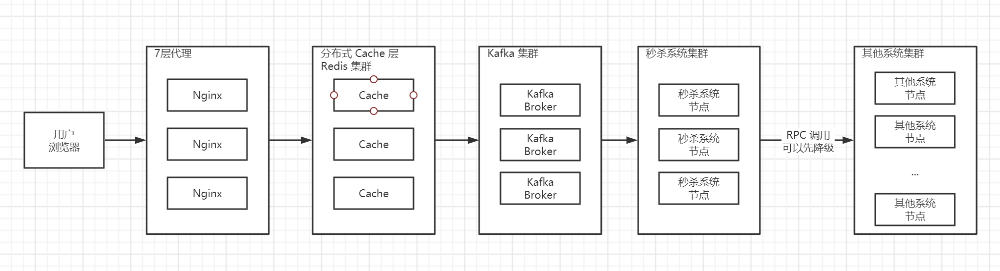

class28

1、（必做）针对课上讲解的内容，自己动手设计一个高并发的秒杀系统，讲架构图，
设计文档等，提交到github。

设计思路：

1.确定秒杀系统场景：

认为其他周边系统都是完备的，如用户、详情、交易、优惠、购物车、库存、物流等系统。

此次设计秒杀系统为在此基础上再架构一个秒杀系统。

2.此次设计只是理论上设计，如果真正需要实现，需要自行实现 demo，在测试环境压测。

3.秒杀系统独立于其他系统，既方便部署维护，又不会抢占资源。

4.秒杀系统与其他系统之间调用是 RPC 调用，具体采用 dubbo 或是 spring cloud openfeign，需要根据其他系统技术栈来匹配。

5.采用微服务架构

- 业务节点无状态，方便在吞吐量不够的情况下加节点。
- 数据节点使用 Shardingsphere-jdbc 或 shardingsphere-proxy 对秒杀商品数据分库分表，提高数据库吞吐量。

6.采用统一 Cache 层，将动态静态热点数据都缓存起来，设置超时时间为3-5秒，保证数据比较新，并且设置 LRU 缓存淘汰策略。使用 Redis 集群实现。

7.使用 Kafka 集群将秒杀抢购信息堆积起来，再通过1个 consumer group 的多个 consumer 并行消费处理，只获取指定商品数量的消息，其余的都丢弃，并通知用户抢购失败。

8.秒杀系统通过 RPC 调用其他系统时，可以先将次要功能（物流、保险等）降级，先处理下单业务，通知用户是否抢购成功。等高峰流量过去后，再处理次要功能业务。

简易架构图如下：

